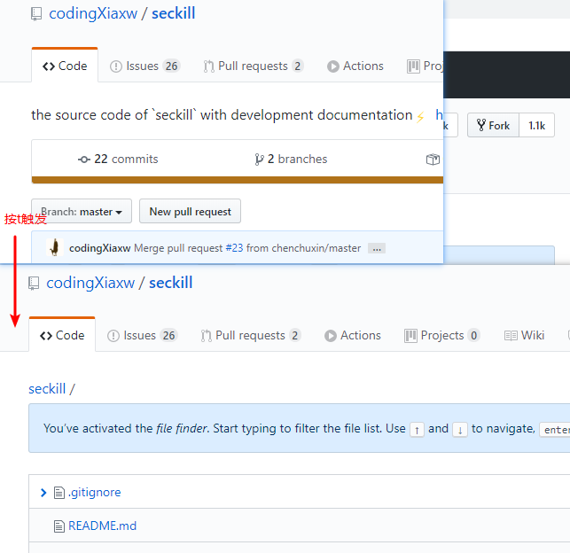

# GitHub骚操作

## 一、常用词

- watch：会持续收到该项目的动态
- fork：复制某个项目到自己的github仓库中
- star：点赞
- clone：克隆到本地
- follow：关注你感兴趣的作者，会受到他们的动态

## 二、in限制查询

### 1、公式

**xxx关键字 in:name或description或readme**

### 2、案例（秒杀系统）

- 在项目中包含：seckill in:name

- 在readme包含：seckill in:readme
- 在描述中包含：seckill in:description
- 组合包含（可以任意组合）：seckill in:name,readme,description

## 三、star和fork搜索

### 1、公式

> 通配符：> 或:>=等
>
> 范围区间：数字1..数字2

xxx关键字 stars 通配符 数值

xxx关键字 forks 通配符 数值

### 2、案例（SpringBoot）

- 点赞超过5000：springboot stars:>=5000

- fork超过500：springboot forks:>500

- 组合查询：springboot forks:100..200 stars:80..100

## 四、awesome加强搜索

> awesome系列，一般用来收集学习、工具、书籍类相关的项目。
>
> 主要去搜索框架、教程等，如awesome redis

### 1、公式

awesome xxx关键字

### 2、案例

awesome redis

## 五、高亮显示某一行代码

### 1、公式

github地址+#L+行号

### 2、案例

github地址：https://github.com/xetorthio/jedis/blob/master/src/test/java/redis/clients/jedis/tests/utils/JedisClusterCRC16Test.java

修改显示高亮，这里是高亮显示18到29行》》》

https://github.com/xetorthio/jedis/blob/master/src/test/java/redis/clients/jedis/tests/utils/JedisClusterCRC16Test.java#L18-L29

## 六、项目内搜索[英文t]

> 指令地址：https://help.github.com/en/github/getting-started-with-github/keyboard-shortcuts

到项目中，**英文t**会触发

## 七、搜索某个地区内的大佬[额外]

### 1、公式

- location:地区
- language:语言

### 2、案例

> 北京地区，java语言

location:beijing language:java

