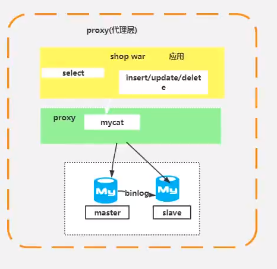

# JAVA高级

## 一、HashMap

### 1、原理

> jdk1.7：数组+链表（hash计算下标碰撞以头部链表插入）
>
> jdk1.8：数组+链表（尾部插入）+红黑树

#### 1）数据结构

- 数组

数组：采取一段连续的存储单元来存储数据

时间复杂度：查询O(1)，插删O(n)；即数组是查询快，插入/删除慢

- 链表

链表：是一种物理存储单元上非连续、非顺序的存储结构

时间复杂度：查询O(n)，插删O(1)；即链表查询慢，插入/删除快

- 红黑树

红黑树：满足树左小右大原则，并且加了其他约束条件。

#### 2）算法

- 哈希算法

#### 3）实现原理

```java
//1、进行put复制
public V put(K key, V value) {
    return putVal(hash(key), key, value, false, true);
}

//2、计算hash值，并与计算hash高16位结果进行异或（>>>是无符号右移）；要是高16位也参与运算，降低碰撞概率。
static final int hash(Object key) {
    int h;
    return (key == null) ? 0 : (h = key.hashCode()) ^ (h >>> 16);
}

//3、计算node节点，i = (n - 1) & hash]来计算数组位置，并将hash值、key、value、next存储到计算的位置
final V putVal(int hash, K key, V value, boolean onlyIfAbsent,
               boolean evict) {
    Node<K,V>[] tab; Node<K,V> p; int n, i;
    if ((tab = table) == null || (n = tab.length) == 0)
        n = (tab = resize()).length;
    if ((p = tab[i = (n - 1) & hash]) == null)
        tab[i] = newNode(hash, key, value, null);
    else {
        Node<K,V> e; K k;
        if (p.hash == hash &&
            ((k = p.key) == key || (key != null && key.equals(k))))
            e = p;
        ...
    }
}

//4、存在hash碰撞，就会使用链表

//5、链表高度大于8使用红黑树
```

```java
/*
*查询
*/
public V get(Object key) {
    Node<K,V> e;
    return (e = getNode(hash(key), key)) == null ? null : e.value;
}
/**
*getNode
*/
final Node<K,V> getNode(int hash, Object key) {
    Node<K,V>[] tab; Node<K,V> first, e; int n; K k;
    if ((tab = table) != null && (n = tab.length) > 0 &&
        (first = tab[(n - 1) & hash]) != null) {
        if (first.hash == hash && // always check first node
            ((k = first.key) == key || (key != null && key.equals(k))))
            return first;
        if ((e = first.next) != null) {
            if (first instanceof TreeNode)
                return ((TreeNode<K,V>)first).getTreeNode(hash, key);
            do {
                if (e.hash == hash &&
                    ((k = e.key) == key || (key != null && key.equals(k))))
                    return e;
            } while ((e = e.next) != null);
        }
    }
    return null;
}
//查询原理：计算hash值得到数组下标，然后获取数组值，进行node里面hash、key的比较，如果满足返回value，如果不满足则判断next是否为空，如果为空则没有结果，如果有记录，则进入next指向的node继续笔记，依次类推
```

### 2、hashmap是否为线程安全

不能说一定，只是能不一定

### 3、为什么jdk8新增红黑树

1）新增红黑树原因

因为链表太长带来效率问题，为了解决链表查询的效率引入红黑树。

在链表长度为8（根据统计学得来的长度）会转成红黑树，但是实际大于等于7的时候。

2）为啥一上来不使用红黑树

因为插入效率慢。

## 二、分库分表

### 1、垂直拆分

> 垂直：将一个属性比较多、一行数据大的表、把不同属性拆分不同表中，降低单库（表）大小的目的来提高性能。如：按照业务区分，分为商品、订单、会员库等

#### 1）特点

- 每个库（表）的结构都不一样（因为业务模块不同，所以字段自然不同）。
- 每个库（表）的数据至少有一列相同的（因为用于数据关联）。

- 每个库（表）的并集是全量数据。

#### 2）缺点

- 受某种业务来决定是否被限制，即数据库瓶颈。如双11订单库压力大，会员库几乎没有。
- 分布式事务、跨库join分页、分布式id、扩容。

#### 3）优点

- 拆分之后业务维护处理变得简单。
- 实现动静分离、冷热数据分离设计（备份管理）。
- 数据维护简单，业务区分放到不同的机器上。

### 2、水平拆分

> 水平：以某个字段按照一定的规律（取模）将一个表的数据分到多个库中，将表中不同的数据行按照一定规律分布到不同的数据库表中（这些表保存在同一个数据库中），这样来降低单表数据量，优化查询性能。如：库一样，不同数据记录管理

#### 1）特点

- 每个库（表）的结构一样，只是记录不同。
- 每个库（表）的数据不同。
- 每个库（表）的并集是全量数据。

#### 2）缺点

- 分布式事务、跨库join分页、分布式id、扩容。
- 不好扩展（不好扩容）。
- 拆分规则很难抽象出来。

#### 3）优点

- 数据库保持一定量的减少，提高性能。
- 解决了数据热点的问题。
- 修表的记录（所以我们程序的类不需要改动）。

### 3、垂直、水平拆分结合使用


### 4、解决方案

#### 1）JDBC直连层


- TDDL

> 淘宝技术

- sharding-jdbc（sharding-sphere）

> 开源框架，可以百度查询

#### 2）Proxy代理层



- mycat

- mysql-proxy

- alatas

#### 3）两者区别

- jdbc性能更好，原因在于proxy存在网络访问。

- jdbc不支持跨语言，proxy支持。
- jdbc支持跨库，proxy不支持。