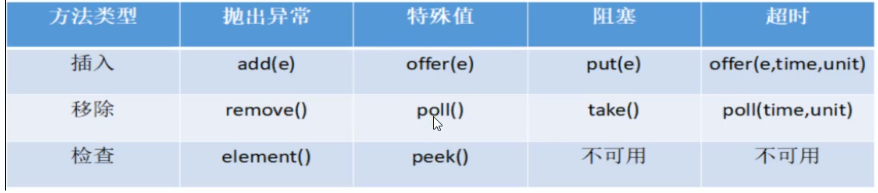
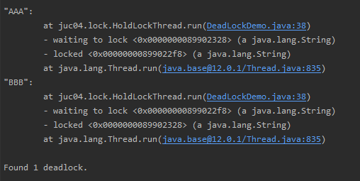

# JUC多线程及高并发

> 相关代码证明在java学习中的juc中

## 一、volatile的理解

### 1、volatile是java虚拟机提供的轻量级的同步机制

- 保证可见性

> 线程间主内存变量修改后的通知

-  ==**不保证原子性**==

> 1）多个线程同时往主内存写值，然后出现数据丢失
>
> 2）如何保证原子性：方法加sync同步关键字（性能差），使用AtomicInteger类去处理。

- 禁止指令重排

> 比如：int x=1; int y=x; 不会先运行int y=x

### 2、AtomicInteger底层是cas

### 3、哪些地方用到过volatile

- 单例模式DCL（double check lock双端检索机制）代码：存在指令重排，所以需要添加volatile

```java
public class SingletonDemo {
    //添加volatile，防止DCL模式代码的多线程不安全。
    private static volatile SingletonDemo instance = null;

    private SingletonDemo() {
        System.out.println(Thread.currentThread().getName() + "构造方法");
    }
    //DCL模式（double check lock双端检索机制）
    //双端检索机制不一定线程安全，因为有指令重排的存在，加入volatile禁止指令重排
    /**
     * **重排说明**
     * 正常流程：1、分配对象内存；2、初始化对象；3、设置instance指向刚分配的内存地址，此时instance!=null
     * 重排情况：1、分配对象内存；2、设置instance指向刚分配的地址，此时instance不为空，但是初始化未完成；3、初始化对象
     */
    public static SingletonDemo getInstance() {
        if (instance == null) {
            //同步块前和同步块后都进行if判断
            synchronized (SingletonDemo.class) {
                if (instance == null) {
                    instance = new SingletonDemo();
                }
            }
        }
        return instance;
    }

    public static void main(String[] args) {
		//多线程调用
    }
}
```

## 二、JMM：java内存模型

### 1、定义

JMM是一种抽象的概念并不真实存在，它描述的是一组规则或规范，规范定义了程序中各个变量（字实例字段、静态字段和构成数组对象的元素）的访问方式。

### 2、JMM关于同步的规定

- 线程解锁前，必须把共享变量的值刷新回主内存。
- 线程加锁前，必须读取主内存的最新的值到自己的工作内存。
- 加锁解锁是同一把锁。


## 三、CAS（compareAndSet比较并交换）

### 1、AtomicInteger为啥不使用synchronized却保证原子性

> CAS是真实值和期望值相等进行修改，失败再进行获取最新值，然后再比较，直到成功。

**底层原理：**

- CAS思想（自旋）
- UnSafe类：基于该类可以直接操作特定内存的数据，==该类存在于sun.misc包中，其内部方法操作可以像C的指针一样直接操作内存。==CAS执行过程不允许被中断，也就是说CAS是一条CPU的原子指令。

```java
private static final jdk.internal.misc.Unsafe U = jdk.internal.misc.Unsafe.getUnsafe();    
private static final long VALUE = U.objectFieldOffset(AtomicInteger.class, "value");
public final int getAndIncrement() {
    // this：当前对象；VALUE：内存偏移量（内存地址）；1：固定写死加1
    return U.getAndAddInt(this, VALUE, 1);
}

//UnSafe类
@HotSpotIntrinsicCandidate
public final int getAndAddInt(Object o, long offset, int delta) {
    int v;
    do {
        v = getIntVolatile(o, offset);
    } while (!weakCompareAndSetInt(o, offset, v, v + delta));
    return v;
}

//可以看出UnSafe底层都是调用native本地方法
@HotSpotIntrinsicCandidate
public native int     getIntVolatile(Object o, long offset);

@HotSpotIntrinsicCandidate
public final native boolean compareAndSetInt(Object o, long offset,
                                             int expected,
                                             int x);

@HotSpotIntrinsicCandidate
public final boolean weakCompareAndSetInt(Object o, long offset,
                                          int expected,
                                          int x) {
    return compareAndSetInt(o, offset, expected, x);
}
```

### 2、CAS缺点

- 循环时间长，开销大
- 只能保证一个共享变量的原子性操作
- **引出来ABA问题**

### 3、CAS缺点的ABA问题

#### 1）说明

ABA说明：线程a假设10s执行，线程b假设2s执行，对于共享内存，线程b可以对共享变量进行修改再改回来，这样线程a就当作没有修改成功执行。

==即首尾没问题，中间会产生了操作。==

如果不介意中间变化可以不处理。

#### 2）解决方案AtomicStampedReference.java

==**原子引用+新的机制（就是修改版本号（类似时间戳））**==

- 理解原子引用AtomicReference.java

```java
public class AtomicReferenceDemo {
    public static void main(String[] args) {
        User zs = new User("zs", 3);
        User ls = new User("ls", 5);
        AtomicReference<User> atomicReference = new AtomicReference<>();
        atomicReference.set(zs);
        System.out.println(atomicReference.compareAndSet(zs, ls) + "\t" + atomicReference.get().toString());
        System.out.println(atomicReference.compareAndSet(zs, ls) + "\t" + atomicReference.get().toString());
    }
}
```

- 带有时间戳的对象引用AtomicStampedReference.java

```java
static AtomicReference<Integer> atomicReference = new AtomicReference<>(10);
static AtomicStampedReference<Integer> atomicStampedReference = new AtomicStampedReference<>(10, 1);

public static void main(String[] args) {
    System.out.println("*******************ABA问题产生*****************");
    new Thread(() -> {
        // 两次修改完成ABA操作
        atomicReference.compareAndSet(10, 20);//10改成20
        atomicReference.compareAndSet(20, 10);//20改成10
    }, "t1").start();

    new Thread(() -> {
        try {
            TimeUnit.SECONDS.sleep(1);
        } catch (InterruptedException e) {
            e.printStackTrace();
        }
        System.out.println(atomicReference.compareAndSet(10, 30) + "\t" + atomicReference.get());
    }, "t2").start();
    try {
        TimeUnit.SECONDS.sleep(2);//保证上面线程执行完成
    } catch (InterruptedException e) {
        e.printStackTrace();
    }
    System.out.println("*******************ABA问题产生*****************");
    System.out.println("*******************解决ABA问题*****************");
    new Thread(() -> {
        int stamp = atomicStampedReference.getStamp();
        System.out.println(Thread.currentThread().getName() + "\t第一次版本号" + stamp);
        try {
            TimeUnit.SECONDS.sleep(1);//保证上面线程执行完成
        } catch (InterruptedException e) {
            e.printStackTrace();
        }
        atomicStampedReference.compareAndSet(10, 20, atomicStampedReference.getStamp(), atomicStampedReference.getStamp() + 1);
        System.out.println(Thread.currentThread().getName() + "\t第二次版本号" + atomicStampedReference.getStamp());
        atomicStampedReference.compareAndSet(20, 10, atomicStampedReference.getStamp(), atomicStampedReference.getStamp() + 1);
        System.out.println(Thread.currentThread().getName() + "\t第三次版本号" + atomicStampedReference.getStamp());
    }, "t3").start();
    new Thread(() -> {
        int stamp = atomicStampedReference.getStamp();
        System.out.println(Thread.currentThread().getName() + "\t第一次版本号" + stamp);
        try {
            TimeUnit.SECONDS.sleep(3);
        } catch (InterruptedException e) {
            e.printStackTrace();
        }
        boolean r = atomicStampedReference.compareAndSet(10, 30, stamp, stamp + 1);
        System.out.println(Thread.currentThread().getName() + "\t修改结果：" + r + "|最新版本号：" + atomicStampedReference.getStamp() + "|最新引用：" + atomicStampedReference.getReference());
    }, "t4").start();
}
```

## 四：集合不安全

### 1、ArrayList

1）并发异常java.util.ConcurrentModificationException

> 导致原因：在一个写的期间，并另一个线程抢过去操作

2）解决方案

- 1）new Vector<>()
 *    2）Collections.synchronizedList(new ArrayList<String>())
 *    3）new CopyOnWriteArrayList<>()

```java
// CopyOnWriteArrayList类方法
public boolean add(E e) {
    synchronized (lock) {
        Object[] es = getArray();
        int len = es.length;
        es = Arrays.copyOf(es, len + 1);
        es[len] = e;
        setArray(es);
        return true;
    }
}
```

### 2、HashSet

> 解决方式同ArrayList的第2，3点

### 3、HashMap

> 解决方式：        
>
> 1）Map<String, String> map = new ConcurrentHashMap<>();
> 2）Collections.synchronizedMap()；

## 五、java锁

### 1、公平锁、非公平锁

```java
// ReentrantLock类实现公平和非公平锁
public ReentrantLock(boolean fair) {
        sync = fair ? new FairSync() : new NonfairSync();
    }
```

1）定义

- 公平锁：指多个线程按照申请锁的顺序来获取锁，类似排队打饭，先来后到
- 非公平锁：指多个线程获取锁的顺序并不是按照申请锁的顺序，有可能后申请的线程比先申请的线程优先获取所；**在高并发情况下，有可能造成优先级反转或饥饿现象**。

2）区别

- 公平锁性能差一点，但保证顺序
- 公平锁按申请锁顺序获取

### 2、可重入锁（又名递归锁）

1）定义

指的是同一线程外层函数获得锁之后，内层递归函数仍然能获取该锁的代码，在同一线程在外层方法获取锁的时候，在进入内层方法会自动获取锁。即==**线程可以进入任何一个它已经拥有的锁所同步着的代码块**==

```java
// 代码案例
public sync void method1(){
    method2();//调用method2
}
public sync void method2(){
    // 代码
}
/**
 *ReentrantLock/sync就是典型的可重入锁
 */
```

**ReentrantLock/sync就是典型的可重入锁**！！！

2）作用

可重入锁最大的作用就是避免死锁

```java
java中，解决死锁一般有如下方法：
1)尽量使用tryLock(long timeout, TimeUnit unit)的方法(ReentrantLock、ReentrantReadWriteLock)，设置超时时间，超时可以退出防止死锁。 
2)尽量使用java.util.concurrent(jdk 1.5以上)包的并发类代替手写控制并发，比较常用的是ConcurrentHashMap、ConcurrentLinkedQueue、AtomicBoolean等等，实际应用中java.util.concurrent.atomic十分有用，简单方便且效率比使用Lock更高 
3)尽量降低锁的使用粒度，尽量不要几个功能用同一把锁 
4)尽量减少同步的代码块
```

### 3、自旋锁

1）定义

指尝试获取锁的线程不会立即阻塞，而是==**采用循环的方式去尝试获取锁**==，这样的好处是减少线程上下文切换的消耗，缺点是循环灰消耗cpu。

CAS思想（自旋）

```java
//UnSafe类
@HotSpotIntrinsicCandidate
public final int getAndAddInt(Object o, long offset, int delta) {
    int v;
    do {
        v = getIntVolatile(o, offset);
    } while (!weakCompareAndSetInt(o, offset, v, v + delta));
    return v;
}
```

### 4、独占锁（写锁）/共享锁（读锁）/互斥锁

ReentrantReadWriteLock.java

## 六、CountDownLatch/CyclicBarrier/Semaphore

### 1、CountDownLatch

> 1、让一些线程阻塞直到另一些线程完成一系列操作后才被唤醒
>
> 2、CountDownLatch主要有两个方法，当一个或多个线程调用await方法时，调用线程会被阻塞。其他线程调用countDown方法会将计数器减1（调用countDown方法的线程不会阻塞)，当计数器的值变成0时，因调用await方法被阻塞的线程会被唤醒，继续执行。

```java
public class CountDownLatchDemo {
    public static void main(String[] args) throws InterruptedException {
        CountDownLatch latch = new CountDownLatch(6);
        for (int i = 1; i <= 6; i++) {
            new Thread(() -> {
                System.out.println(Thread.currentThread().getName() + "\t 国被灭");
                latch.countDown();//计数减一
            }, CountryEnum.contryForEach(i).getValue()).start();
        }
        latch.await();//计数到0就不阻塞
        System.out.println("******秦灭6国，一统华夏");
    }
}

@Getter
enum CountryEnum {
    ONE(1, "齐"), TWO(2, "楚"), THREE(3, "燕"), FOUR(4, "赵"), FIVE(5, "魏"), SIX(6, "韩");
    private int key;
    private String value;

    CountryEnum(int key, String value) {
        this.key = key;
        this.value = value;
    }

    public static CountryEnum contryForEach(int index) {
        CountryEnum[] values = CountryEnum.values();
        for (CountryEnum value : values) {
            if (index == value.key) {
                return value;
            }
        }
        return null;
    }
}
```

### 2、CyclicBarrier

> 1、可循环使用的屏障。它要做的事情是，让一组线程到达一个屏障（也叫做同步点）时被阻塞，直到最后一个线程到达屏障时，屏障才会开门，所有被屏障拦截的线程才会继续干活，线程进入屏障通过CyclicBarrier的await()方法。
>
> 即：集齐龙珠召唤神龙，与countDownLatch相反。

```java
public class CyclicBarrierDemo {
    public static void main(String[] args) {
        CyclicBarrier barrier = new CyclicBarrier(7, () -> {
            System.out.println("完成收集，召唤神龙！");
        });
        for (int i = 1; i <= 7; i++) {
            new Thread(() -> {
                System.out.println(Thread.currentThread().getName() + "\t 星球被收集！");
                try {
                    barrier.await();
                } catch (InterruptedException e) {
                    e.printStackTrace();
                } catch (BrokenBarrierException e) {
                    e.printStackTrace();
                }
            }, String.valueOf(i)).start();
        }
    }
}
```

### 3、Semaphore

> 1、信号量主要用于两个目的，一个是用于多个共享资源的互斥使用，另一个用于并发线程数的控制。
>
> 案例：争车位

```java
public class SemaphoreDemo {
    public static void main(String[] args) {
        //信号灯：多个线程抢多个资源，在配置1的时候相当于lock和sync

        Semaphore semaphore = new Semaphore(3);//3个停车位
        for (int i = 1; i <= 6; i++) {//6部汽车
            final int temp = i;
            new Thread(() -> {
                try {
                    semaphore.acquire();//抢到
                    System.out.println(Thread.currentThread().getName() + "\t抢到车位");
                    //暂停
                    try {
                        TimeUnit.SECONDS.sleep(3);
                    } catch (Exception e) {
                        e.printStackTrace();
                    }
                    System.out.println(Thread.currentThread().getName() + "\t停3秒离开");
                } catch (InterruptedException e) {
                    e.printStackTrace();
                } finally {
                    semaphore.release();//释放资源
                }
            }, String.valueOf(i)).start();
        }
    }
}
```

## 七、阻塞队列

### 1、阻塞队列的种类


### 2、BlockingQueue的核心方法



```java
package juc09.queue;

import java.util.concurrent.ArrayBlockingQueue;
import java.util.concurrent.BlockingQueue;
import java.util.concurrent.TimeUnit;

/**
 * ArrayBlockingQueue:是一个基于数组结构的有界阻塞队列，此队列按FIFO原则对元素进行排序
 * LinkedBlockingDeque:一个基于链表结构的阻塞队列，此队列按FIFO排序元素，吞吐量通常高于ArrayBlockingQueue
 * SynchronousQueue:一个不存储元素的阻塞队列，每个插入操作必须等到另一个线程调用移除操作，否则插入操作一直处于阻塞状态，吞吐量通常要高于ArrayBlockingQueue
 *
 * @author sayyes
 * @date 2020/5/17
 */
public class BlockingQueueDemo {
    public static void main(String[] args) throws InterruptedException {

        BlockingQueue<String> blockingQueue = new ArrayBlockingQueue<>(3);
        System.out.println(blockingQueue.offer("a", 2L, TimeUnit.SECONDS));//true
        System.out.println(blockingQueue.offer("b", 2L, TimeUnit.SECONDS));//true
        System.out.println(blockingQueue.offer("c", 2L, TimeUnit.SECONDS));//true
        System.out.println(blockingQueue.offer("d", 2L, TimeUnit.SECONDS));//false

        System.out.println(blockingQueue.poll(2L, TimeUnit.SECONDS));//a
        System.out.println(blockingQueue.poll(2L, TimeUnit.SECONDS));//b
        System.out.println(blockingQueue.poll(2L, TimeUnit.SECONDS));//c
        System.out.println(blockingQueue.poll(2L, TimeUnit.SECONDS));//null
    }


    //ArrayBlockingQueue 的 offer、poll、peek
    public static void ArrayBlockingQueueMethod3() throws InterruptedException {
        BlockingQueue<String> blockingQueue = new ArrayBlockingQueue<>(3);
        blockingQueue.put("a");
        blockingQueue.put("b");
        blockingQueue.put("c");
//        blockingQueue.put("d");//队列满阻塞

        System.out.println(blockingQueue.take());
        System.out.println(blockingQueue.take());
        System.out.println(blockingQueue.take());
        System.out.println(blockingQueue.take());//消费完阻塞
    }

    //ArrayBlockingQueue 的 offer、poll、peek
    public static void ArrayBlockingQueueMethod2() {
        BlockingQueue<String> blockingQueue = new ArrayBlockingQueue<>(3);
        System.out.println(blockingQueue.offer("a"));
        System.out.println(blockingQueue.offer("b"));
        System.out.println(blockingQueue.offer("c"));
        System.out.println(blockingQueue.offer("d"));//不抛异常

        System.out.println(blockingQueue.peek());//检查队列头部元素a

        System.out.println(blockingQueue.poll());//a
        System.out.println(blockingQueue.poll());//b
        System.out.println(blockingQueue.poll());//c
        System.out.println(blockingQueue.poll());//null
    }

    //ArrayBlockingQueue 的 add、remove、element
    public static void ArrayBlockingQueueMethod() {
        BlockingQueue<String> blockingQueue = new ArrayBlockingQueue<>(3);
        System.out.println(blockingQueue.add("a"));
        System.out.println(blockingQueue.add("b"));
        System.out.println(blockingQueue.add("c"));
        //队列插入异常：java.lang.IllegalStateException: Queue full
//        System.out.println(blockingQueue.add("d"));
        System.out.println(blockingQueue.element());

        System.out.println(blockingQueue.remove());
        System.out.println(blockingQueue.remove());
        System.out.println(blockingQueue.remove());
        //队列清除异常：java.util.NoSuchElementException
//        System.out.println(blockingQueue.remove());
    }
}

```

ps：**检查方法是检查队列头部元素**

### 3、SynchronousQueue同步队列，生产一个消费一个

```java
package juc09.queue;

import java.util.concurrent.BlockingQueue;
import java.util.concurrent.SynchronousQueue;
import java.util.concurrent.TimeUnit;

/**
 * @author sayyes
 * @date 2020/5/18
 */
public class SynchronousQueueDemo {
    public static void main(String[] args) {
        BlockingQueue<String> blockingQueue = new SynchronousQueue<>();
        new Thread(() -> {
            try {
                System.out.println(Thread.currentThread().getName() + "\t put 1");
                blockingQueue.put("1");

                System.out.println(Thread.currentThread().getName() + "\t put 2");
                blockingQueue.put("2");

                System.out.println(Thread.currentThread().getName() + "\t put 3");
                blockingQueue.put("3");
            } catch (InterruptedException e) {
                e.printStackTrace();
            }
        }, String.valueOf("aaa")).start();

        new Thread(() -> {
            try {
                try {
                    TimeUnit.SECONDS.sleep(5);
                } catch (Exception e) {
                    e.printStackTrace();
                }
                System.out.println(blockingQueue.take());
                try {
                    TimeUnit.SECONDS.sleep(5);
                } catch (Exception e) {
                    e.printStackTrace();
                }
                System.out.println(blockingQueue.take());
                try {
                    TimeUnit.SECONDS.sleep(5);
                } catch (Exception e) {
                    e.printStackTrace();
                }
                System.out.println(blockingQueue.take());
            } catch (Exception e) {
                e.printStackTrace();
            }
        }, String.valueOf("bbb")).start();

    }
}

```

### 4、生产-消费模式

sync：wait，notify -> lock：await，signal

> 这里使用lock加锁

```java
package com.sayyes;

import java.util.concurrent.locks.Condition;
import java.util.concurrent.locks.Lock;
import java.util.concurrent.locks.ReentrantLock;

/**
 * @author sayyes
 * @date 2020/5/18
 */
public class ProConsumeDemo {
    public static void main(String[] args) throws Exception {
        MyData myData = new MyData();
        new Thread(() -> {
            for (int i = 1; i <= 10; i++) {
                myData.increment();
            }
        }, String.valueOf("a")).start();
        new Thread(() -> {
            for (int i = 1; i <= 10; i++) {
                myData.decrement();
            }
        }, String.valueOf("b")).start();
    }
}

class MyData {
    private int number = 0;
    private Lock lock = new ReentrantLock();
    private Condition condition = lock.newCondition();

    public void increment() {
        lock.lock();
        try {
            while (number != 0) {
                condition.await();
            }
            number++;
            System.out.println(Thread.currentThread().getName() + "\t increment number=" + number);
            condition.signalAll();
        } catch (Exception e) {
            e.printStackTrace();
        } finally {
            lock.unlock();
        }
    }

    public void decrement() {
        lock.lock();
        try {
            while (number == 0) {
                condition.await();
            }
            number--;
            System.out.println(Thread.currentThread().getName() + "\t decrement number=" + number);
            condition.signalAll();
        } catch (Exception e) {
            e.printStackTrace();
        } finally {
            lock.unlock();
        }
    }
}

```

## 八、synchronized和lock的区别

- synchronized是关键字，属于jvm（monitorenter入、monitorexit两次出，保证不会出现死锁）；

  lock是具体类，是api层面的锁。

- synchronized不需要用户手动去释放锁，当synchronized代码执行完后系统会自动让线程释放对锁的占用；

  ReentrantLock需要手动释放锁，如果没有主动释放锁，就有可能会导致出现死锁现象。

- synchronized不可中断，除非正常结束或异常结束；

  lock可以中断（1、设置超时方法trylock；2、lockIntereuptibly()放代码块中，调用interrupt方法可中断）。

- synchronized是非公平锁；

  lock可以是公平锁/非公平锁。

- synchronized不能绑定多个条件；

  lock可以通过Condition（await、singal）绑定多个条件，实现精确唤醒，而不像synchronized那么随机唤醒一个，要么全部唤醒。

## 九、线程池

### 1、实现线程的方式

- 实现Runnable接口
- 继承Thread
- 实现Callable接口
- 通过线程池技术

```
区别：
 *1、接口实现的方法不同
 *2、方法一个有异常、一个没有异常
 *3、有无返回值
class MyThread implements Runnable {

    @Override
    public void run() {

    }
}

class MyThread2 implements Callable<Integer> {

    @Override
    public Integer call() throws Exception {
        return 1024;
    }
}
```

### 2、线程池的优势

- 降低资源消耗（不用每次创建）
- 提高相应速度（不用数据库连接关闭）
- 提高线程的可管理性

### 3、Executor、Executors

Executor：接口

Executors：工具类

### 4、Executors方法创建线程池、ThreadPoolExecutor类

> ThreadPoolExecutor+阻塞队列

#### 1）Executors（实际生产不使用，因为存在资源消耗问题）

>     public static ExecutorService newFixedThreadPool(int nThreads) {
>         return new ThreadPoolExecutor(nThreads, nThreads,
>         0L, TimeUnit.MILLISECONDS,
>         new LinkedBlockingQueue<Runnable>());
>     }
>
>     1、创建定长线程池，可以控制线程最大并发数，超出的线程会在队列中等待
>
>     2、newFixedThreadPool创建的线程池corePoolSize和maximumPoolSize是相等的，使用LinkedBlockingQueue
>
>     适用：执行长期任务，性能好很多
>
>     public static ExecutorService newSingleThreadExecutor() {
>         return new FinalizableDelegatedExecutorService
>         (new ThreadPoolExecutor(1, 1,
>         0L, TimeUnit.MILLISECONDS,
>         new LinkedBlockingQueue<Runnable>()));
>     }
>
>     1、创建单线程化的线程池，它只会用唯一的工作线程来执行任务，保证所有任务按顺序执行
>
>     2、newSingleThreadExecutor创建的线程池corePoolSize和maximumPoolSize都是1，使用LinkedBlockingQueue
>
>     适用：一个任务一个任务执行的场景
>
>     public static ExecutorService newCachedThreadPool() {
>         return new ThreadPoolExecutor(0, Integer.MAX_VALUE,
>         60L, TimeUnit.SECONDS,
>         new SynchronousQueue<Runnable>());
>     }
>
>     1、创建一个可缓存的线程池，如果线程长度超过处理需要，可灵活回收空闲线程，若无可回收，则新建线程
>
>     2、newCachedThreadPool将corePoolSize设为0，将maximumPoolSize设为 Integer.MAX_VALUE，使用SynchronousQueue，也就是说来了任务就创建线程运行，当线程空闲超过60s，就销毁线程
>
>     适用：执行很多短期异步的小程序或者负载较轻的服务器

```java
//        ExecutorService threadPool = Executors.newFixedThreadPool(5);//固定数线程:一池5线程
//        ExecutorService threadPool = Executors.newSingleThreadExecutor();//一池1线程
ExecutorService threadPool = Executors.newCachedThreadPool();//一池N数线程（可扩容）
try {
    for (int i = 1; i <= 10; i++) {
        threadPool.execute(() -> {
            System.out.println(Thread.currentThread().getName() + "\t办理业务");
        });
    }
} catch (Exception e) {
    e.printStackTrace();
} finally {
    threadPool.shutdown();//关闭
}
```

#### 2）前面的Executors方法实现线程池的底层调用ThreadPoolExecutor类

```java
public ThreadPoolExecutor(int corePoolSize,
                          int maximumPoolSize,
                          long keepAliveTime,
                          TimeUnit unit,
                          BlockingQueue<Runnable> workQueue,
                          ThreadFactory threadFactory,
                          RejectedExecutionHandler handler) {
    if (corePoolSize < 0 ||
        maximumPoolSize <= 0 ||
        maximumPoolSize < corePoolSize ||
        keepAliveTime < 0)
        throw new IllegalArgumentException();
    if (workQueue == null || threadFactory == null || handler == null)
        throw new NullPointerException();
    this.corePoolSize = corePoolSize;
    this.maximumPoolSize = maximumPoolSize;
    this.workQueue = workQueue;
    this.keepAliveTime = unit.toNanos(keepAliveTime);
    this.threadFactory = threadFactory;
    this.handler = handler;
}
```

#### 3）ThreadPoolExecutor七大参数：

- corePoolSize：线程池中的常驻核心线程数
- maximumPoolSize：线程池能容纳同时执行的最大线程数，此值必须大于等于1
- keepAliveTime：多余的空闲线程的存活时间（线程超过核心数就会扩容，扩容的线程会在空闲达到该时间销毁，直到剩下核心数的线程为止）
- unit：keepAliveTime的单位
- workQueue：任务队列，被提交但尚未被执行的任务
- threadFactory：表示生成线程池中工作线程工厂，用于创建线程，一般使用默认
- handler：拒绝策略，表示当队列满了并且工作线程大于等于线程池的最大线程数（maximumPoolSize）如何拒绝

### 4、线程池工作原理（重要）


1）在创建线程池后，等待提交过来的任务请求

2）当调用execute()方法添加一个请求任务时，线程池会做如下判断：

- 如果正在运行的线程数量小于corePoolSize，那么马上创建线程运行这个任务
- 如果正在运行的线程数量大于或等于corePoolSize，那么将这个任务==**放入队列**==
- 如果这个时候队列满了且正在运行的线程数量还小于maximumPoolSize，那么还是要创建非核心线程立刻运行这个任务
- 如果队列满了且正在运行的线程数量大于或等于maximumPoolSize，那么线程==**会启动饱和拒绝策略来执行**==
- 当一个线程完成任务时，他会从队列中取下一个任务来执行
- 当一个线程无事可做超过一定的时间（keepAliveTime）时，线程池会判断

### 5、线程池的4大拒绝策略

- new ThreadPoolExecutor.DiscardPolicy() ：直接丢弃任务，不予任何处理也不抛出异常，如果允许任务丢失，这是最好的一种方案。
- new ThreadPoolExecutor.DiscardOldestPolicy()：抛弃队列中等待最久的任务，然后把当前任务加入队列中尝试再次提交当前任务。
- new ThreadPoolExecutor.CallerRunsPolicy() ："调用者运行"一种调节机制，不抛异常
- new ThreadPoolExecutor.AbortPolicy()默认 ：抛异常java.util.concurrent.RejectedExecutionException阻止系统正常运行

### 6、如何合理配置线程池参数（根据业务）

> 先运行RunTime.getRuntime().availableProcessors()查看机器几核

1）CPU密集型

- cpu密集的意思是该任务需要大量的运算，而没有阻塞，cpu一直全速运行
- cpu密集任务只有在真正的多核cpu上面才可能得到加速（通过多线程）

ps:在单核cpu上，无论你开几个模拟的多线程该任务都不可能加速

==**【重要】CPU密集任务配置尽可能少的线程数量，一般公式：CPU核数+1个线程的线程池**==

2）IO密集型

- 由于IO密集型任务线程并不是一直在执行任务（常规）

  ==**【重要】配置尽可能多的线程，如CPU核数*2**==

- 需要大量的IO，即大量的阻塞

  ==**【重要】参考公式：CPU核数/（1 - 阻塞系数）**==

  一般阻塞系数在0.8~0.9之间，所以8核cpu：8/（1-0.9）=80

### 7、线程池代码处理

```java
ThreadPoolExecutor threadPoolExecutor = new ThreadPoolExecutor(
    2,
    5,
    2L,
    TimeUnit.SECONDS,
    new LinkedBlockingQueue<>(3),
    Executors.defaultThreadFactory(),
    new ThreadPoolExecutor.DiscardOldestPolicy());
try {
    for (int i = 1; i <= 9; i++) {
        final int temp = i;
        threadPoolExecutor.execute(() -> {
            System.out.println(Thread.currentThread().getName() + "\t第" + temp + "位人");
        });
    }
} catch (Exception e) {
    e.printStackTrace();
} finally {
    threadPoolExecutor.shutdown();
}
```


## 十、死锁编码及定位分析

> 死锁：指两个或两个以上的线程在执行过程中，因争夺资源造成的一种互相等待的现象，若无外力干涉那他们都将无法推进下去，如果系统资源充足，线程的资源请求都能够得到满足，死锁出现的可能性就很低，否则就会因争夺有限资源而陷入死锁。
>
> 即持有自己的锁，想要得到别人的锁，吃着碗里，想着锅里的。


### 1、造成死锁的原因

1）系统资源不足

2）进程运行推进的顺序不合适

3）资源分配不当

### 2、死锁案例

```java
package juc04.lock;

import java.util.concurrent.TimeUnit;

/**
 * 死锁案例
 *
 * @author sayyes
 * @date 2020/5/21
 */
public class DeadLockDemo {
    public static void main(String[] args) {
        String lockA = "lockA";
        String lockB = "lockB";
        new Thread(new HoldLockThread(lockA, lockB), String.valueOf("AAA")).start();
        new Thread(new HoldLockThread(lockB, lockA), String.valueOf("BBB")).start();
    }
}

class HoldLockThread implements Runnable {

    private String lockA;
    private String lockB;

    public HoldLockThread(String lockA, String lockB) {
        this.lockA = lockA;
        this.lockB = lockB;
    }

    @Override
    public void run() {
        synchronized (lockA) {
            System.out.println(Thread.currentThread().getName() + "\t自己持有" + lockA + "\t尝试获取" + lockB);
            try {
                TimeUnit.SECONDS.sleep(2);
            } catch (Exception e) {
                e.printStackTrace();
            }
            synchronized (lockB) {
                System.out.println(Thread.currentThread().getName() + "\t自己持有" + lockB + "\t尝试获取" + lockA);
            }
        }
    }
}

```

### 3、解决方式（以第2点案例运行中）

1）jps查看进程号


2）jstack [进程号] 



3）修改出问题的代码（第38行左右）