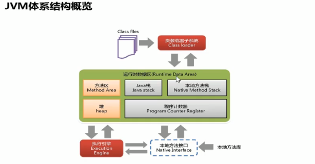
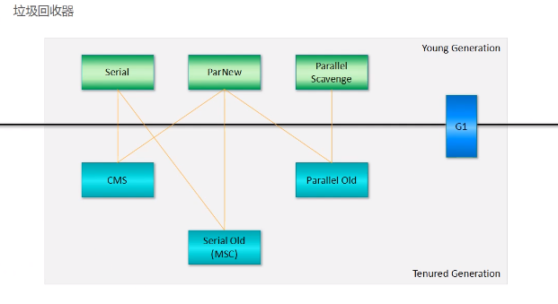
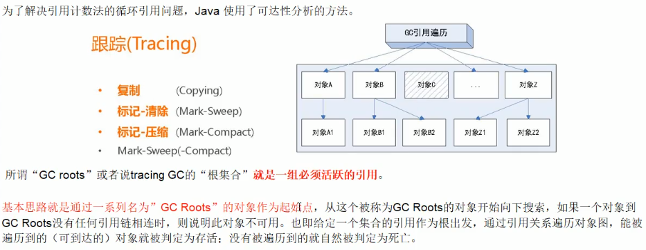
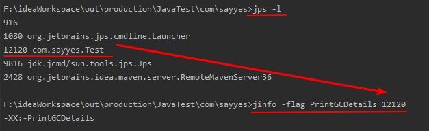
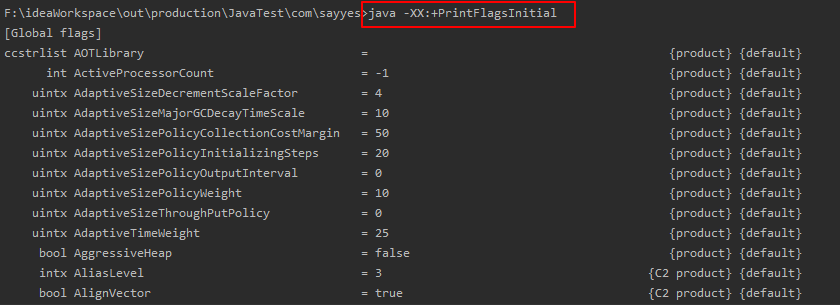
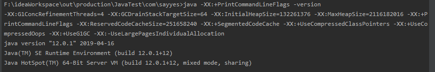
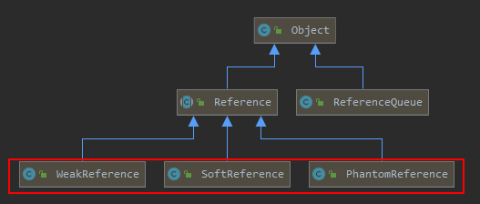

# JVM虚拟机



## 一、类加载机制

- 启动类加载器

- 扩展类加载器
- 应用程序类加载器
- 自定义类加载器

> 双亲委派（父类加载的不给子类加载、一个类加载一次）
>
> 沙箱安全（委派保证安全）

### 第一步：加载

1）获取二进制字节流

2）静态存储结构转换为方法区的运行时数据结构

3）在java堆里面生成一个类对象，作为方法区访问入口

### 第二步：验证

1）验证Class文件的标识：魔数Magic Number

2）验证版本号

3）验证常量池

4）验证Class文件的每个部分（字段表、方法表等）

5）元数据验证（父类验证、继承验证、final验证）

6）字节码验证（指令验证）

7）符号引用验证（通过符号引用是否能找到字段、方法、类）

### 第三步：准备

1）分配内存变量并设置类变量的初始化阶段

2）只对static类变量进行内存分配

> static int n=1；
>
> 初始化值是0，而不是1，因为还没有执行任何java方法
>
> static final int n=1；
>
> 对应常量池ConstantValue，在准备阶段n必须被赋值成1；

### 第四步：解析

1）符号引用解析（符号引用->直接引用）

> 直接引用：指向目标的指针或者偏移量
>
> 符号引用->直接引用：
>
> 主要涉及：类、接口、字段、方法（接口、类）等

2）字段解析

3）类方法解析

4）接口方法解析

### 第五步：初始化

> clinit静态变量、静态块的初始化
>
> init类的初始化
>
> Class A{
>
> ​	static int i=2;//静态变量
>
> ​	static {
>
> ​		//处理
>
> ​	}
>
> ​	int n;//实例变量
>
> }

## 二、字节码执行机制

> java一开始是解释执行，后面出现JIT编译执行，故是混合执行

- 输入字节码文件
- 处理过程是字节码解释的过程
- 输出的是执行结果

## 三、JVM内存模型

- 方法区（类信息、常量、静态变量、即时编译器编译后的代码）
- 堆
- java栈（最小配置108k，默认1M；栈帧：局部变量表[数据基本类型、引用]、操作数栈、动态连接）
- 本地方法栈（调用c/c++库）
- 程序计数器（下一条指令地址）
- 类加载器
- 执行引擎

## 四、GC垃圾回收（垃圾回收算法、回收器）

1、对堆、方法区进行回收

2、分代收集算法

- 引用计数：缺点是计数器本身存在消耗，较难处理循环引用

- 复制算法（年轻代）
- 标记清除（老年代）
- 标记整理

3、默认垃圾回收器

- jdk1.7/1.8：Parallel Scavenge（新生代）+Paralled Old
- jdk1.9：G1



```
垃圾回收器：
1、Serial收集器：串行收集器，【适用用户的桌面级场景】
2、ParNew收集器：并行收集器，【适用server首选的新生代收集器】
3、Parallel Scavenge收集器：并行收集器，与ParNew区别在于可以自适应调节策略【适用后台计算不需要太多交互】
新生代》》》》老年代
4、Concurrent Mark Sweep收集器：使用“标记-清除”算法，【适用互联网站或web服务器】
5、Serial Old收集器：Serial收集器的老年代收集器，使用“标记-整理”算法，【适用用户的桌面级场景】
6、Paralled Old收集器：Parallel Scavenge收集器的老年代版本，使用“标记-整理”算法，【用户的桌面应用场景】
新生代《《》》老生代
7、G1收集器（在jdk1.9）：垃圾回收器将堆内存分割成不同的区域然后并发的对其进行垃圾回收。
```

可以组合关系

Serial->CMS（不推荐组合）、Serial Old

ParNew->CMS、Serial Old（不推荐组合）、Paralled Old

Parallel Scavenge->Paralled Old

4、内存分配

- 对象首先进入Eden区，大对象直接进入老年代

> 新生代：Eden+s0+s1=Xmn
>
> 问题：-Xmn 100m -XX:SurvivorRatio=8，请问Eden区多大？
>
> 解：Eden：s0：s1 = SurvivorRatio：1：1，即100*（8/（8+1+1））
>
> 调优考虑少触发Full GC，尽可能的在Minor GC完成回收（新生代内存：老年代内存=1：2）

- 根据存活判断，默认存活15次进入老年代

## 五、JVM性能监控与故障定位

> jdk附带工具

### 1、jinfo：配置信息工具

### 2、jstat：统计信息监控工具

> Case:类加载统计、编译统计、垃圾回收统计

```
用法：jstat [-命令选项][vmid][间隔时间][查询次数]
命令选项：
-class
-compiler
-gcutil
-gccause
其他都是成对出现
-gc*
-gc*capacity
```

### 3、jmap：内存映像工具

> Case:映射对快照、抓取堆内存

```
用法：jmap [-命令选项][vmid]
命令选项：
-dump
-histo
-permstat
-heap
-finalizerinfo
-F
```

对于其中指令产生的hprof文件需要**MAT**的Eclipse工具可以分析内存情况。

### 4、jstack：栈堆异常跟踪工具

```
用法：jstack [-命令选项][vmid]
命令选项：
-F
-l
-m
```

### 5、jconsole监控工具

### 6、jvisualvm（jconsole的升级版本）

## 六、JVM调优

### 1、合理编程

1）非堆内存处理

- 堆外内存
- 文件句柄
- Socket句柄
- 数据库连接

```
文件：
限制文件大小，异步方式

网络IO：
限流

大对象：
对于JVM绝对是一个噩梦
避免使用大对象，尽量减少大对象的生存时间
```

### 2、充分并合理的使用硬件资源

JDK32位版本尽量使用32版本，内存最高可以使用4G

### 3、合理地进行JVM调优

- 降低Full GC的频次，一天1-2次，控制在晚上，重启服务器或定时触发Full GC

- 确保大多数对象“朝生夕死”

- 堆高大对象进入老年代的门槛（-XX:MaxTenuringThreshold=15）

垃圾回收器的选择可以提高效率！！！

JVM初始分配的堆内存由-Xms指定，默认是物理内存的1/64；JVM最大分配的堆内存由-Xmx指定，默认是物理内存的1/4

```
常用配置的参数：
-Xss:栈内存大小
-Xmn:新生代内存大小
-Xms:堆初始化内存大小
-Xmx:堆允许的最大内存大小
PermSize:初始化分配的非堆内存
MaxPermSize:允许分配的最大非堆内存
SurvivorRatio=n:新生代eden区与幸存者区的比例值
UserConcMarkSweepGC:垃圾回收器，这里是CMS回收器
HeapDumpOnOutOfMemoryError:oom异常时记录异常日志
-Xloggc:[路径]记录文件
PrintGCDetails:打印gc日志
```

## 七、cpu内存过高如何查看问题

> 结合linux和jdk命令一块分析

第一步：先top查看cpu占比最高的进程

第二步：ps -ef 或 jps进一步定位，得知是一个怎么样的一个后台程序

第三步：==**定位到具体线程或者代码**==

```
#查看cpu占用高的进程有哪些线程，cpu高的tid
ps -mp 进程 -o THREAD,tid,time
```

第四步：将需要的线程ID转换为16进制格式（英文小写格式）

```
#指令转换进制
printf "%x\n" 有问题的线程ID
#若不会指令就计算器计算
```

第五步：jstack 进程ID | grep tid(16进制线程id小写英文) -A60

> 如：进程为5000的线程100的指令查看，-A60是查看前60行
>
> jstack 5000 | grep 100 -A60

## 八、面试题目

### 1、JVM垃圾回收的时候如何确定垃圾？是否知道什么事GC Roots

#### 1）什么是垃圾

简单来说就是内存中已经不再被使用到的空间就是垃圾。

#### 2）如何判断一个对象是否可以被回收？

- 方案1：引用计数法（实际不使用）

- 方案2：枚举根节点做可达性分析（根搜索路径），即GC Roots



==**（重要）必须以GC Roots为起点的引用可达对象才不会当作垃圾回收**==

#### 3）可以作为GC Roots的对象

- 虚拟机栈（栈帧中的局部变量区，也叫做局部变量表）中引用的对象。
- 方法区中的类静态属性引用的对象。
- 方法区中常量引用的对象。
- 本地方法栈中JNI（Native方法）引用的对象。

### 2、JVM调优和参数设置，请问如何盘点查看JVM系统默认值

#### 1）JVM的参数类型

- 标配参数

```java
-version
-help
java -showversion
```

- X参数（了解）

```
常用几个如下：
-Xint：解释执行
-Xcomp：第一次使用就编译成本地代码
-Xmixed：混合模式
```

- ==**XX参数**==

#### 2）XX参数详解

- Boolean类型

```
公式：
-XX:+ 或者 - 某个属性值
     +表示开启，-表示关闭

案例：
-XX:+PrintGCDetails（激活）
-XX:-PrintGCDetails（未激活）
```

- KV设值类型

```
公式：
-XX:属性（key）=属性值（value）

案例：
-XX:MetaspaceSize=128m（元空间内存大小）
-XX:MaxTenuringThreshold=15（新生代存活多少次可以进入老年代）
```

- jinfo举例

```
公式：
查看指定参数：jinfo -flag [jvm参数] [pid]
查看能查到的所有参数：jinfo -flags [pid]
```

#### 3）如何查看正在运行的java程序，他的某个jvm参数是否开启或具体值是多少？

> jps+jinfo查看
>
> jinfo -flag [jvm参数] [pid]



这里是没有添加PrintGCDetails，因为前面是“-”

### 3、如何解释-Xms和-Xmx不满足JVM参数类型？

- -Xms等价于-XX:InitialHeapSize
- -Xmx等价于-XX:MaxHeapSize

### 4、除了jinfo可以查看参数外，还有java -XX:+***指令查看（重要）

#### 1）==**java -XX:+PrintFlagsInitial**==查看初始默认值



#### 2）==**java -XX:+PrintFlagsFinal**==主要查看修改更新的内容

> 这个可以进行java运行时打印参数，如：
>
> **java -XX:+PrintFlagsFinal  -Xss128k [运行java类名]**

对于展示（可参考第一点图片），存在"="和"：="，"="是初始化，"：="是修改过的

#### 3）==**java -XX:+PrintCommandLineFlags -version**==查看修改的参数



### 5、JVM常用的基本配置参数有哪些

```
常用参数：
-Xms:初始大小内存，默认为物理内存的1/64，等价于-XX:InitialHeapSize
-Xmx:最大分配内存，默认为物理内存的1/4，等价于-XX:MaxHeapSize
-Xss:设置单个线程栈的大小，一般默认为512k-1024k，等价于-XX:ThreadStackSize
-Xmn:新生代大小，一般使用默认，新生代占堆的1/3
-XX:MetaspaceSize:元空间不在虚拟机中，使用本地内存，默认大概21M，可以配置大一些
-XX:PrintGCDetails:打印垃圾回收的日志
-XX:SurvivorRatio:伊甸区占新生代的比例。默认是8：1：1
-XX:NewRatio:新生代和老年代的比例，默认是2，指老年代为2，新生代为1
-XX:MaxTenuringThreshold:设置垃圾回收的最大年龄，默认15，必须设置0-15之间的值
```

### 6、引用（强、软、弱、虚）



#### 1）强引用（默认支持）：死了都不会回收

当内存不足，JVM开始垃圾回收，对于强引用的对象，==就算是出现了OOM也不会对该对象进行回收，死都不收==；即使该对象以后永远都不会被用到也不会被回收，因此强引用是造成java内存泄漏的主要原因之一。

```java
public static void main(String[] args) {
    Object object1 = new Object();//强引用
    Object object2 = object1;//object2引用赋值
    object1 = null;//改变object1的值
    System.gc();//垃圾回收object1,不会回收Object2
    System.out.println(object1);
    System.out.println(object2);
}
```

#### 2）软引用：内存足不会收，内存不足回收

内存充足时它不会被回收，内存不足时会被回收；通常用在对内存敏感的程序中，比如高速缓存就有用到软引用，**内存够用的时候就保留，不够就回收**。

```java
public static void main(String[] args) {
    Object o1 = new Object();
    SoftReference<Object> o2 = new SoftReference<>(o1);//软引用
    System.out.println(o1);
    System.out.println(o2.get());//get获取引用

    o1 = null;
    System.gc();

    System.out.println(o1);
    System.out.println(o2.get());//内存足不回收，内存不足回收
}
```

#### 3）弱引用：不管内存是否充足都要回收

运行垃圾回收，不管内存是否充足，弱引用都要被回收

```java
    public static void main(String[] args) {
        Object o1 = new Object();
        WeakReference<Object> o2 = new WeakReference<>(o1);//弱引用
        System.out.println(o1);
        System.out.println(o2.get());//get获取引用

        o1 = null;
        System.gc();

        System.out.println(o1);
        System.out.println(o2.get());//弱引用被回收
    }
```

#### 4）虚引用：在任何时候都有可能被垃圾回收，要跟ReferenceQueue联合使用

- 虚引用是最弱的引用
- 虚引用对对象而言是无感知的，对象有虚引用跟没有是完全一样的
- 虚引用不会影响对象的生命周期
- 虚引用可以用来做为对象是否存活的监控

### 7、知道弱引用，能谈谈WeakHashMap吗

> 以前解决并发，出现ConcurrentHashMap
>
> 现在解决缓存清空，保证性能，出现WeakHashMap

```java
//        HashMap<Integer,String> map = new HashMap<>();
//        {1=我是1}
//        {1=我是1}
//        {1=我是1}	1
WeakHashMap<Integer, String> map = new WeakHashMap<>();
//        {1=我是1}
//        {1=我是1}
//        {}	0
Integer key = new Integer(1);
String value = "我是1";
map.put(key, value);
System.out.println(map);

key = null;
System.out.println(map);

System.gc();
try {
    TimeUnit.SECONDS.sleep(1);
} catch (Exception e) {
    e.printStackTrace();
}
System.out.println(map + "\t" + map.size());// WeakHashMap会被垃圾回收
}
```

### 8、谈谈你对OOM的认识（OOM是JVM的错误）

OOM即OutOfMemoryError

#### 1）java.lang.StackOverflowError

```java
public static void main(String[] args) {
    stackOverflowErrorDemo();
}

private static void stackOverflowErrorDemo() {
    stackOverflowErrorDemo();
}
```

#### 2）java.lang.OutOfMemoryError：java heap space

> 运行时将-Xmx设置为10m，初始化就分配一个10m的变量内存，直接爆掉

```java
public static void main(String[] args) {
    heapSpaceError();
}

private static void heapSpaceError() {
    byte[] bytes = new byte[10 * 1024 * 1024];
}
```

#### 3）java.lang.OutOfMemoryError：GC overhead limit exceeded

```java
public static void main(String[] args) {
    //        System.out.println("11");
    gcOverhead();
    //        System.out.println("配置maxDirectMemory：" + jdk.internal.misc.VM.maxDirectMemory());
    //        ByteBuffer bb = ByteBuffer.allocate(6*1024*1024);
}


private static void gcOverhead() {
    int i = 0;
    List<String> list = new ArrayList();
    try {
        while (true) {
            list.add(String.valueOf(++i).intern());
        }
    } catch (Throwable e) {
        System.out.println("********i:" + i);
        e.printStackTrace();
        throw e;
    }
}
```

#### 4）java.lang.OutOfMemoryError：Direct buffer memory

> 1、写NIO程序常用ByteBuffer来读写数据，这是一种基于通道与缓冲区的I/O方式
>
> 2、ByteBuffer.allocate()是分配**堆内存**，属于gc管辖，优于需要拷贝所以速度相对较慢
>
> 3、ByteBuffer.allocateDirect()是分配**本地内存**（非堆内存外的cpu内存），不属于gc管辖，不cp，速度相对较快
>
> **ps：堆内存默认占cpu内存的1/4，也就是说其他的都属于本地内存**
>
> 即，如果不停分配本地内存，堆内存很少使用，那么jvm就不需要执行gc，DirectByteBuffer对象就不会回收，这时候堆内存充足，但本地内存已经使用光了，再次尝试分配本地内存就会出现OOM，程序就奔溃了

程序配置jvm参数：-Xms10m -Xmx10m -XX:MaxDirectMemorySize=5m

```java
public static void main(String[] args) {
    maxDirectMemoryMethod();
}

private static void maxDirectMemoryMethod() {
    System.out.println("配置maxDirectMemory：" + VM.maxDirectMemory());
    ByteBuffer bb = ByteBuffer.allocateDirect(6 * 1024 * 1024);
}
```

#### 5）java.lang.OutOfMemoryError：unable to create new native thread

> 1、一个应用创建线程太多，超过系统承载极限就会抛错
>
> 2、服务器不允许创建太多线程，linux系统默认允许单个进程可以创建的线程是1024
>
> 解决：1、降低线程数量；2、修改linux的配置扩大允许可创建的线程数量
>
> linux服务器调整配置：
>
> ​	ulimit -u 查看运行最大线程数量
>
> ​	vi /etc/security/limits.d/90-nproc.conf 修改

```java
public static void main(String[] args) {
    nativeMethod();
}

private static void nativeMethod() {
    for (int i = 1; ; i++) {
        System.out.println("**********i=" + i);
        new Thread(() -> {
            //让线程一直存在
            try {
                TimeUnit.SECONDS.sleep(1000);
            } catch (Exception e) {
                e.printStackTrace();
            }
        }, String.valueOf(i)).start();
    }
}
```

#### 6）java.lang.OutOfMemoryError：Metaspace

> 1、java1.8的元空间（方法区在HotSpot的实现）
>
> 2、Metaspace的默认是21m左右
>
> **永久代转成元空间的原因：**
>
> 　　**1、字符串存在永久代中，容易出现性能问题和内存溢出。**
>
> 　　**2、类及方法的信息等比较难确定其大小，因此对于永久代的大小指定比较困难，太小容易出现永久代溢出，太大则容易导致老年代溢出。**
>
> 　　**3、永久代会为 GC 带来不必要的复杂度，并且回收效率偏低。**
>
> 　　**4、Oracle 可能会将HotSpot 与 JRockit 合二为一。**

配置jvm参数：-XX:MetaspaceSize=10m -XX:MaxMetaspaceSize=10m

```java
static class OOMClass { }

public static void main(String[] args) {
    metaspaceMethod(args);
}

private static void metaspaceMethod(String[] args) {
    int i = 0;
    try {
        while (true) {
            i++;
            Enhancer enhancer = new Enhancer();//spring的动态字节码技术
            enhancer.setSuperclass(OOMClass.class);
            enhancer.setUseCache(false);
            enhancer.setCallback(new MethodInterceptor() {
                @Override
                public Object intercept(Object o, Method method, Object[] objects, MethodProxy methodProxy) throws Throwable {
                    return methodProxy.invokeSuper(o, args);
                }
            });
            enhancer.create();
        }
    } catch (Throwable e) {
        System.out.println("**********多少次发生异常" + i);
        e.printStackTrace();
    }
}
```

### 9、垃圾回收算法、垃圾回收器

> 4大算法，7大垃圾回收器
>
> ps：7大垃圾回收器是垃圾回收算法的实现

#### 1）4大主要垃圾回收器

- serial收集器（串行）：收集会暂停所有用户线程，不适用服务器环境。
- Parallel收集器（并行）：串行加强版，也会暂停用户线程，但减少暂停的时间。
- CMS收集器（并发）：垃圾收集和用户线程同时执行，用户线程不用完全暂停，互联网项目使用较多。
- G1收集器：垃圾回收器将堆内存分割成不同的区域然后并发的对其进行垃圾回收。

#### 2）怎么查看服务器默认的垃圾收集器？

使用==**java -XX:+PrintCommandLineFlags -version**==查看

#### 3）7大垃圾收集器，6大jvm配置类型（并行老年gc被废弃了呢）

#### 4）Server/Client模式分别是什么？

> 1、适用范围：只需要掌握Server模式，Client模式基本不用。
>
> 2、操作系统：
>
> ​	2.1	32位win操作系统，不论硬件如何都默认使用Client的jvm模式。
>
> ​	2.2	32位其他操作系统，2g内存同时有2个cpu以上用Server模式，低于该配置还是Client模式。
>
> ​	2.3	64位只有Server模式。

#### 5）垃圾收集器的默认组合

- 新生代

> 1、配置-XX:+UseSerialGC
>
> ​	默认组合：serial -> serial old
>
> 2、配置-XX:+UseParNewGC 
>
> ​	默认组合：parnew -> serial old（不推荐）
>
> ​	使用-XX:ParallelGCThreads限制收集线程数量，默认开启和cpu数目相同的线程数
>
> 3、配置-XX:+UseParallelGC
>
> ​	默认组合：parallel s -> parallel old

- 老年代

> 1、配置-XX:+UseParallelOldGC
>
> ​	默认组合：parallel s -> parallel old
>
> 2、配置-XX:+UseConcMarkSweepGC
>
> ​	默认组合：parnew -> cms

#### 6）CMS并发标记清除四步

- 初始标记

  > 需要暂停工作线程，速度很快

- 并发标记和用户线程一起

  > 不需要暂停工作进程

- 重新标记

  > 需要暂停所有的工作线程，做标记修正

- 并发清除和用户线程一起

  > 不需要暂停工作线程

#### 7）CMS回收失败会怎么样？

由于并发进行，CMS在收集与应用线程同时执行会增加堆内存的占用，也就是说，==**CMS必须要在老年代堆内存用尽之前完成垃圾回收，否则CMS回收失败**==，回收失败，会触发担保机制，串行老年代收集器将会以STW的方式进行一次GC，从而造成较大停顿时间。

#### 8）如何选择垃圾收集器

- 单cpu或小内存，单机程序

  > -XX:+UseSerialGC

- 多cpu，需要最大吞吐量，如后台计算型应用

  > -XX:+UseParallelGC 或 -XX:+UseParallelOldGC

- 多cpu，追求低停顿时间，需要快速响应，如互联网应用

  > -XX:+UseConcMarkSweepGC


### 10、G1（Garbage-First）收集器

> G1整体采用标记-整理算法，局部通过复制算法，不会产生内存碎片；
>
> **与CMS相比优势：**
>
> ​	**1）有整理过程，不会产生内存碎片。**
>
> ​	**2）停顿更可控，G1在停顿时间上添加了预测机制，用户可以指定期望停顿时间。**

1）G1是面向服务端应用的收集器，不区分新生与老年代。

2）像CMS收集器一样，可以并发执行。

3）区域化内存划分region（块）。

4）收集步骤

- 初识标记
- 并发标记
- 最终标记
- 筛选回收

5）常用G1收集器配置

- -XX:UseG1GC
- -XX:G1HeapRegionSize=n:设置g1区域的大小，值是2的幂，范围1-32m，默认划分2048个区域。
- -XX:MaxGCPauseMillis=n:最大gc停顿时间，软目标。
- -XX:ConcGCThreads=n:并发gc使用的线程数
- -XX:G1ReservePercent=n:设置作为空闲空间的预留内存百分比，以降低目标空间溢出的风险，默认10%
- -XX:InitialingHeapOccupancyPercent=n:堆占用了多少的时候就触发GC，默认45