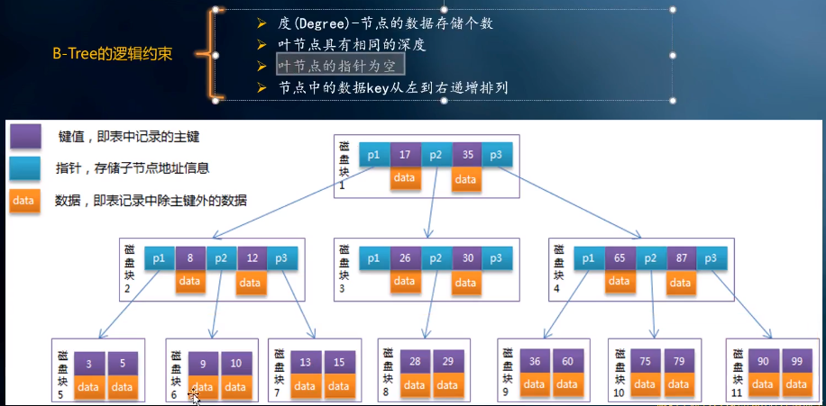
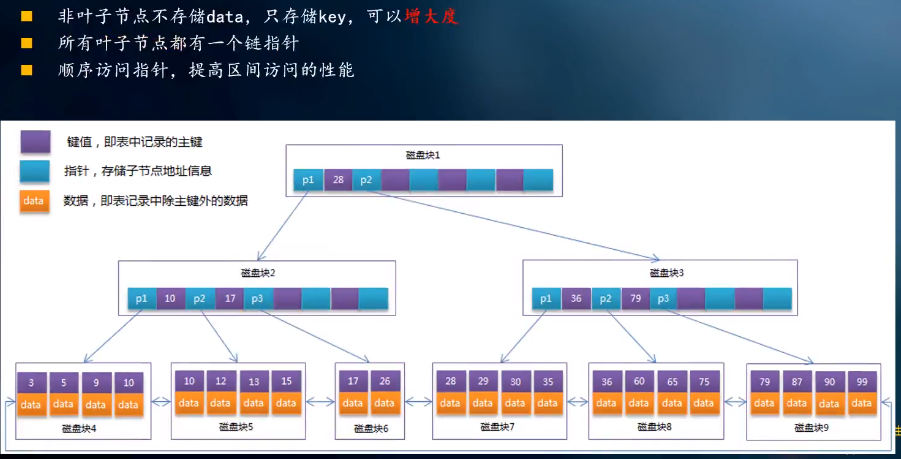
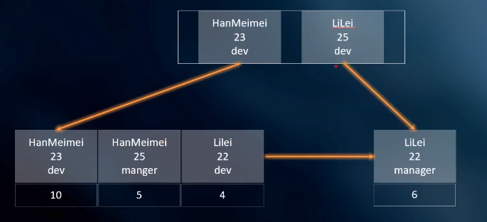

# MySQL数据库

## 一、基础学习

### 1、mysql的innodb引擎默认使用B+树

磁盘预读16k，这也是mysql的一页大小是16k

### 2、为啥使用B+树（层层递进）

层层递进分析，分析其他结构：

#### 1）全部遍历

#### 2）Hash

```
1）增删改查平均时间复杂度O(1)，找一次就可以找到
2）Hash不支持范围和排序查找
```

#### 3）树：二叉树、平衡二叉树

```
1）增删改查平均时间复杂度O(log2(n));
2）左小右大，存在全小和全大会退化成链表，复杂度变成O（n），所以需要平衡二叉树
3）问题：数据多会导致树高，io就多，所以要考虑矮胖，出现B树
```

#### 4）B树



```
1）B树允许一个节点可以有多个元素，这样就会把平衡二叉树压低
2）[指针][值][指针][值][指针]，值是主键，主键会包含数据
```

#### 5）B+树



```
1）进一步降低高度
2）B+数有根、支、叶子，叶子节点增加链表，所有节点不需要进行中序遍历（左中右）
```

### 3、B树与B+树的不同

- 非叶子节点只存储键值信息（b+在叶子节点）

> 索引节点没有数据。比较小。b树可以吧索引完全加载至内存中，提高性能。

- 叶子节点之间有链指针（b+有链）

> b+树更擅长范围查询。叶子节点 数据是按顺序放置的双向链表。 b树范围查询只能中序遍历。

- 数据记录都放在叶子节点（b+都是）

> b+树的数据都集中在叶子节点。分支节点 只负责索引。 b树的分支节点也有数据 

### 4、数据库索引

> 索引的目的在于提高查询效率，不过也要考虑对表数据操作导致的索引效率。结合实际情况来考虑是否使用索引。

#### 1）创建索引

```sql
##公式##
ALTER TABLE 表名 ADD [UNIQUE | FULLTEXT | SPATIAL] INDEX | KEY [索引名] (字段名1 [(长度)] [ASC | DESC]) [USING 索引方法];
或
CREATE [UNIQUE | FULLTEXT | SPATIAL] INDEX 索引名 ON 表名(字段名) [USING 索引方法];
```

```sql
案例1：
-- 给projectfile表中的fileuploadercode创建索引
ALTER TABLE projectfile ADD UNIQUE INDEX (fileuploadercode);

案例2：
ALTER TABLE projectfile ADD INDEX (fileuploadercode, projectid);

案例3：
-- 将id列设置为主键
ALTER TABLE index_demo ADD PRIMARY KEY(id) ;
-- 将id列设置为自增
ALTER TABLE index_demo MODIFY id INT auto_increment; 
```

#### 2）删除索引

```sql
##公式##
DROP INDEX 索引名 ON 表名
或
ALTER TABLE 表名 DROP INDEX 索引名
```

```sql
案例1：
drop index fileuploadercode1 on projectfile;

案例2：
alter table projectfile drop index s2123;
```

#### 3）查询索引

```sql
##公式##
show index from 表名;
或
工具查看
```

#### 4）查看sql执行计划

==**在select语句前加上EXPLAIN即可。**==

主要查看type：

type：联接类型。是SQL性能的非常重要的一个指标，结果值从好到坏依次是：system > const > eq_ref > ref
           -> fulltext > ref_or_null > index_merge > unique_subquery > index_subquery > range > index > ALL

## 二、常见面试题

### 1、聚簇索引和非聚簇索引的区别

1）聚簇索引

> 数据和索引放在一起；如：主键索引为聚簇索引


2）非聚簇索引

> 数据和索引不在一起


### 2、innodb怎么保证必有主键

- 如果表定义了主键，就使用定义主键
- 如果没有定义主键，就找唯一索引，存在就当作主键
- 如果没主键也无唯一索引，innodb内部生成一个（不推荐）

### 3、为什么推荐==使用整型的自增主键==

#### 1）存储空间

> 节省空间

#### 2）索引维护的成本

> 更新数据，索引变化会影响性能

### 4、为什么非主键索引结构子节点存储的是==主键值而不是数据==

> 存储的空间
>
> 数据的一致性

### 5、MyISAM与InnoDB 的区别

**1）InnoDB支持事务，MyISAM不支持**

**2）InnoDB支持外键，而MyISAM不支持**

**3）InnoDB是聚集索引，MyISAM是非聚集索引**

- InnoDB是聚集索引，使用B+Tree作为索引结构，数据文件是和（主键）索引绑在一起的（表数据文件本身就是按B+Tree组织的一个索引结构），必须要有主键，通过主键索引效率很高。但是辅助索引需要两次查询，先查询到主键，然后再通过主键查询到数据。因此，主键不应该过大，因为主键太大，其他索引也都会很大
- MyISAM是非聚集索引，也是使用B+Tree作为索引结构，索引和数据文件是分离的，索引保存的是数据文件的指针。主键索引和辅助索引是独立的。

**4）InnoDB不保存表的具体行数，MyISAM用一个变量保存了整个表的行数**

- InnoDB不保存表的具体行数，执行select count(\*) from table时需要全表扫描。而MyISAM用一个变量保存了整个表的行数，执行上述语句时只需要读出该变量即可，速度很快（注意不能加有任何WHERE条件）；

**5）Innodb不支持全文索引，而MyISAM支持全文索引**

- PS：**5.7以后的InnoDB支持全文索引了**

**6）MyISAM表格可以被压缩后进行查询操作**

**7）InnoDB支持表、行(默认)级锁，而MyISAM支持表级锁**

**8）InnoDB表必须有主键（用户没有指定的话会自己找或生产一个主键），而Myisam可以没有**

**9）Innodb存储文件有frm、ibd，而Myisam是frm、MYD、MYI**

>  **Innodb：frm是表定义文件，ibd是数据文件**
>
>  **Myisam：frm是表定义文件，myd是数据文件，myi是索引文件**

### 6、联合索引结构

> 概念：表内多个字段组成的索引

以下为name名字、age年龄、position职位的联合索引结构图

#### 

### ==7、索引使用注意事项（重要）==

#### 1）不需要使用索引的情况

- 频繁更新的字段不要使用索引,频繁更新会导致索引也会频繁更新,降低写的效率。
- 字段不在where语句出现时不要添加索引:只有在where语句出现，mysql才会去使用索引。
- 数据量少的表不要使用索引,使用了改善也不大。
- 唯一性差的字段不适合创建索引,因为无法准确的找到想要的数据,所以查完索引后依然还需要过一遍数据,这样反而增加了查询量。
- 索引使用<>时，效果很差，一般不需要使用

#### 2）索引失效的情况

- 如果条件中有or，or条件中的每个列都加上索引，索引才生效.可考虑用UNION替换。
- 对于多列索引，不是使用的第一部分，则不会使用索引。
- like查询是以%开头。
- 条件索引列存在运算。
- 条件索引列使用了函数（这里可以建立基于函数创建索引使其生效）。
- 条件索引列使用 <> 、not in 、not exist、!=
- 隐式转换导致索引失效，如：字符串要用引号引起来。


